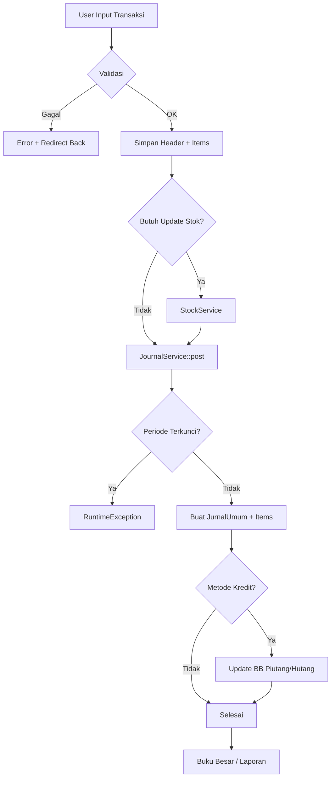
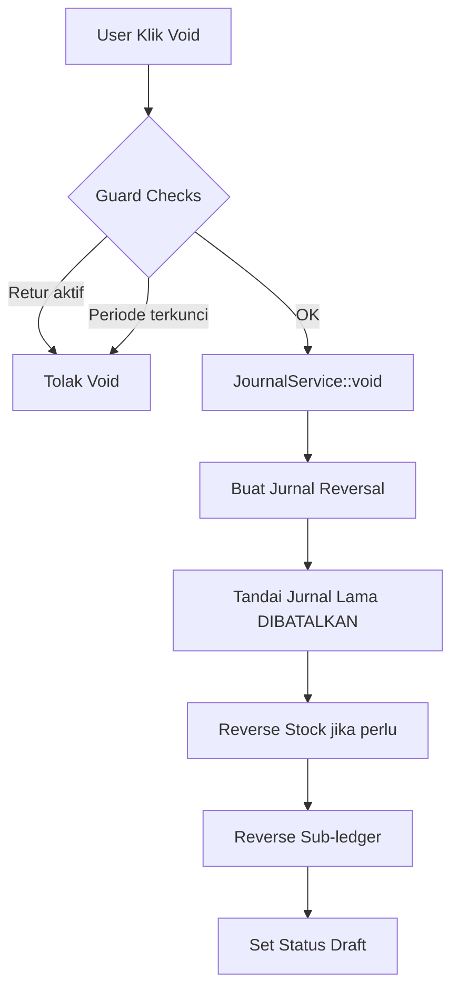
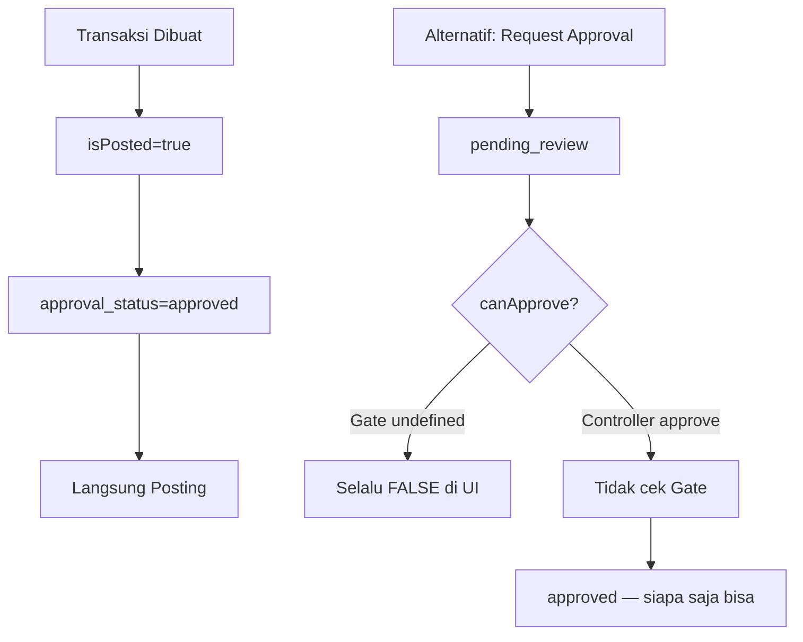

# Analisis Sistem — Logika, Alur, dan Rekomendasi Perbaikan

> **Proyek:** Sistem Pengelolaan Keuangan Semi-Akuntansi  
> **Stack:** Laravel 13 · PHP 8.3 · Blade · Tailwind CSS · Alpine.js · DomPDF  
> **Tanggal analisis:** 7 September 2026  
> **Status test:** 124 test · 123 lulus · 1 gagal (`ExampleTest`)  
> **Catatan:** Dokumen ini bersifat **read-only** — tidak ada kode yang diubah saat analisis.

---

## Daftar Isi

1. [Ringkasan Eksekutif](#1-ringkasan-eksekutif)
2. [Arsitektur Sistem](#2-arsitektur-sistem)
3. [Modul dan Fitur](#3-modul-dan-fitur)
4. [Struktur Database](#4-struktur-database)
5. [Alur Bisnis Utama](#5-alur-bisnis-utama)
6. [Mesin Akuntansi Inti](#6-mesin-akuntansi-inti)
7. [Diagram Alur](#7-diagram-alur)
8. [Autentikasi dan Otorisasi](#8-autentikasi-dan-otorisasi)
9. [Inventaris dan Metode Biaya](#9-inventaris-dan-metode-biaya)
10. [Cakupan Testing](#10-cakupan-testing)
11. [Bug dan Kekurangan Teridentifikasi](#11-bug-dan-kekurangan-teridentifikasi)
12. [Daftar Perbaikan Prioritas](#12-daftar-perbaikan-prioritas)
13. [Panduan Implementasi Perbaikan](#13-panduan-implementasi-perbaikan)
14. [Referensi File Penting](#14-referensi-file-penting)

---

## 1. Ringkasan Eksekutif

Sistem ini adalah aplikasi web **semi-akuntansi untuk UKM (Usaha Kecil Menengah)** berbahasa Indonesia yang menggabungkan:

| Aspek | Implementasi |
|-------|-------------|
| Akuntansi | Double-entry bookkeeping (debit = kredit) |
| Inventori | Weighted Average (RATT / harga rata-rata tertimbang) |
| Transaksi | Pembelian, penjualan, kas, transfer, retur |
| Pelaporan | Laba Rugi, Neraca (web + PDF) |
| Kontrol periode | Buka/kunci periode, tutup buku |

### Kekuatan Sistem

- Arsitektur service layer yang jelas (`JournalService`, `StockService`, `ReportService`, `PeriodeService`)
- Alur transaksi → jurnal → sub-buku besar terintegrasi
- Modul inventori lengkap (opname, perubahan stok, retur pembelian/penjualan)
- Test suite cukup kuat untuk retur, inventori, daftar harga, dan approval (123/124 lulus)
- Migrasi schema menunjukkan evolusi matang (merge `bahan_baku`+`produk` → `barang`, merge `kas`+`banks` → `rekenings`)

### Kelemahan Utama

| # | Area | Dampak |
|---|------|--------|
| 1 | **Tidak ada sistem role/permission** | Semua user punya akses penuh |
| 2 | **Gate `approve-transactions` tidak didefinisikan** | Workflow approval tidak berfungsi penuh |
| 3 | **Approval bypass** — `JurnalController::approve()` tidak cek izin | Siapa saja bisa approve jurnal |
| 4 | **Beberapa modul belum ditest** | Kas, mutasi bank, tutup buku, laporan |
| 5 | **NomorGenerator sequence global** | Format menampilkan bulan/tahun tapi seq tidak reset per bulan |
| 6 | **Tidak ada API** | Hanya web UI, tidak ada integrasi eksternal |

---

## 2. Arsitektur Sistem

### 2.1 Struktur Direktori

```
app/
├── Http/Controllers/
│   ├── Master/          # Data master (akun, rekening, barang, supplier, dll.)
│   ├── Transaksi/       # Kas, pembelian, penjualan, inventori
│   ├── Akuntansi/       # Jurnal, buku besar, periode, tutup buku
│   └── Laporan/         # Laba rugi, neraca
├── Models/              # 37 model Eloquent
├── Services/            # Logika bisnis inti
│   ├── JournalService.php
│   ├── StockService.php
│   ├── ReportService.php
│   ├── PeriodeService.php
│   └── NomorGenerator.php
├── Traits/
│   └── HasApprovalWorkflow.php
└── Helpers/helpers.php  # formatRupiah(), setting(), formatTanggal()

resources/views/
├── layouts/             # app, sidebar, topbar, bottom-nav
├── components/          # card, page-header, alert, form inputs
├── master/              # CRUD master data
├── transaksi/           # Form & detail transaksi
├── inventori/           # Opname, retur, perubahan stok
├── akuntansi/           # Jurnal, buku besar, periode
└── laporan/             # Laba rugi, neraca (+ PDF)

database/
├── migrations/          # 22 migrasi aplikasi
└── seeders/             # COA, admin, pajak, pengaturan
```

### 2.2 Pola Arsitektur

```
[Browser] → [Controller] → [Service Layer] → [Model/DB]
                ↓
           [Blade View]
```

- **Controller:** Validasi input, orchestrasi, redirect + flash message
- **Service:** Logika akuntansi, stok, laporan (static methods)
- **Model:** Relasi Eloquent, accessor, trait approval
- **Tidak ada:** Repository pattern, DTO, Event/Listener untuk transaksi, Queue jobs

### 2.3 Tech Stack

| Layer | Teknologi | Versi |
|-------|-----------|-------|
| Backend | Laravel | 13.17 |
| PHP | PHP | 8.3 |
| Auth | Laravel Breeze | 2.4 |
| CSS | Tailwind CSS | 3.x/4.x |
| JS | Alpine.js + Vite | 3.x / 8.x |
| PDF | barryvdh/laravel-dompdf | 3.1 |
| QR Scanner | html5-qrcode | 2.3.8 |
| Database | SQLite (dev) / MySQL (prod) | — |
| Testing | PHPUnit | 12.x |

---

## 3. Modul dan Fitur

### 3.1 Peta Modul (Sidebar)

| Grup Menu | Modul | Route Prefix | Controller |
|-----------|-------|-------------|------------|
| **Menu Utama** | Dashboard | `/dashboard` | `DashboardController` |
| **Master Data** | Akun Perkiraan | `/akun-perkiraan` | `Master\AkunPerkiraanController` |
| | Rekening (Kas/Bank) | `/rekening` | `Master\RekeningController` |
| | Supplier | `/supplier` | `Master\SupplierController` |
| | Customer | `/customer` | `Master\CustomerController` |
| | Barang | `/barang` | `Master\BarangController` |
| | Jasa | `/jasa` | `Master\JasaController` |
| | Daftar Harga | `/daftar-harga` | `Master\DaftarHargaController` |
| | Pajak | `/pajak` | `Master\PajakController` |
| **Transaksi** | Kas Masuk | `/kas-masuk` | `Transaksi\KasMasukController` |
| | Kas Keluar | `/kas-keluar` | `Transaksi\KasKeluarController` |
| | Transfer Rekening | `/mutasi-bank` | `Transaksi\MutasiBankController` |
| | Pembelian | `/pembelian` | `Transaksi\PembelianController` |
| | Penjualan | `/penjualan` | `Transaksi\PenjualanController` |
| **Inventori** | Perubahan Stok | `/perubahan-stok` | `Transaksi\PerubahanStokController` |
| | Stok Opname | `/stok-opname` | `Transaksi\StokOpnameController` |
| | Retur Penjualan | `/retur-penjualan` | `Transaksi\ReturPenjualanController` |
| | Retur Pembelian | `/retur-pembelian` | `Transaksi\ReturPembelianController` |
| **Akuntansi** | Jurnal Umum | `/jurnal` | `Akuntansi\JurnalController` |
| | Buku Besar | `/buku-besar` | `Akuntansi\BukuBesarController` |
| | BB Piutang | `/bb-piutang` | `Akuntansi\BbPiutangController` |
| | BB Hutang | `/bb-hutang` | `Akuntansi\BbHutangController` |
| | BB Persediaan | `/bb-persediaan` | `Akuntansi\BbPersediaanController` |
| | Periode Akuntansi | `/periode` | `Akuntansi\PeriodeController` |
| | Tutup Buku | `/tutup-buku` | `Akuntansi\TutupBukuController` |
| **Laporan** | Laba Rugi | `/laporan/laba-rugi` | `Laporan\LabaRugiController` |
| | Neraca | `/laporan/neraca` | `Laporan\NeracaController` |
| **Pengaturan** | Profil Perusahaan | `/pengaturan` | `PengaturanController` |

**Total route bisnis:** ~130 route (termasuk auth Breeze)

### 3.2 Chart of Accounts (COA) Default

Seeder: `database/seeders/AkunPerkiraanSeeder.php`

| Kode | Nama | Jenis | Saldo Normal |
|------|------|-------|-------------|
| 111 | Kas | Aset | Debit |
| 112 | Bank | Aset | Debit |
| 113 | Piutang Dagang | Aset | Debit |
| 114 | Persediaan Bahan Baku | Aset | Debit |
| 115 | Persediaan Barang Dagang | Aset | Debit |
| 211 | Utang Usaha | Kewajiban | Kredit |
| 212 | Utang PPN Keluaran | Kewajiban | Kredit |
| 213 | PPN Masukan | Kewajiban | Kredit |
| 31 | Modal | Modal | Kredit |
| 32 | Laba Ditahan | Modal | Kredit |
| 33 | Laba/Rugi Berjalan | Modal | Kredit |
| 411 | Penjualan Barang | Pendapatan | Kredit |
| 412 | Pendapatan Jasa | Pendapatan | Kredit |
| 421 | Pendapatan Lain-lain | Pendapatan | Kredit |
| 51 | HPP | Beban | Debit |
| 531 | Beban Lain-lain | Beban | Debit |

### 3.3 User Default

```
Email: admin@keuangan.test
Password: admin123
```

---

## 4. Struktur Database

### 4.1 Diagram Relasi Utama

```
akun_perkiraan (COA hierarkis)
    ↓
rekenings (kas/bank → akun_id)
    ↓
kas_masuk / kas_keluar / mutasi_bank
pembelians / penjualans
    ↓
jurnal_umum (polymorphic ref)
    ↓
jurnal_items (debit/kredit per akun)
    ↓
bb_piutang / bb_hutang / bb_persediaan (sub-ledger)

barang (tipe: barang|jasa)
    ↓
pembelian_items / penjualan_items
daftar_harga (tiered pricing)
bb_persediaan (inventory card)
```

### 4.2 Tabel Utama (37 model)

#### Master Data
| Tabel | Model | Catatan |
|-------|-------|---------|
| `akun_perkiraan` | AkunPerkiraan | Hierarki parent-child, is_header |
| `rekenings` | Rekening | jenis: kas/bank, linked ke akun COA |
| `suppliers` | Supplier | Dengan accessor `saldo_hutang` |
| `customers` | Customer | Dengan accessor `saldo_piutang` |
| `barang` | Barang | Unified barang+jasa, stok, harga_avg |
| `daftar_harga` | DaftarHarga | Tiered pricing per supplier/customer |
| `daftar_harga_riwayat` | DaftarHargaRiwayat | Audit perubahan harga |
| `pajak` | Pajak | Rate PPN |
| `pengaturan` | Pengaturan | Key-value settings |
| `satuan`, `kategori` | Satuan, Kategori | Master referensi barang |
| `periode_akuntansi` | PeriodeAkuntansi | is_open, is_locked, is_closed |

#### Transaksi
| Tabel | Model | Relasi Jurnal |
|-------|-------|--------------|
| `kas_masuk` + items | KasMasuk | morphOne JurnalUmum |
| `kas_keluar` + items | KasKeluar | morphOne |
| `mutasi_bank` | MutasiBank | morphOne |
| `pembelians` + items | Pembelian | morphOne |
| `penjualans` + items | Penjualan | morphMany (penjualan + HPP) |

#### Inventori
| Tabel | Model | Jurnal Type |
|-------|-------|------------|
| `perubahan_stok` + items | PerubahanStok | `penyesuaian_stok` |
| `stok_opname` + items | StokOpname | `penyesuaian_stok` |
| `retur_penjualan` + items | ReturPenjualan | `retur_penjualan` |
| `retur_pembelian` + items | ReturPembelian | `retur_pembelian` |

#### Akuntansi
| Tabel | Model | Fungsi |
|-------|-------|--------|
| `jurnal_umum` | JurnalUmum | Header jurnal + approval |
| `jurnal_items` | JurnalItem | Baris debit/kredit |
| `bb_piutang` | BbPiutang | Sub-ledger piutang |
| `bb_hutang` | BbHutang | Sub-ledger hutang |
| `bb_persediaan` | BbPersediaan | Kartu persediaan per barang |
| `tutup_buku` | TutupBuku | Record penutupan periode |
| `audit_trails` | AuditTrail | Log perubahan polymorphic |

### 4.3 Evolusi Schema (Migrasi Penting)

| Tanggal | Migrasi | Perubahan |
|---------|---------|-----------|
| 2026-09-03 | `create_master_tables` | COA, supplier, customer, produk, bahan_baku |
| 2026-09-03 | `create_transaksi_tables` | Kas, pembelian, penjualan |
| 2026-09-03 | `create_akuntansi_tables` | Jurnal, sub-ledger, tutup buku |
| 2026-09-03 | `create_rekenings_merge` | Merge kas + banks → rekenings |
| 2026-09-03 | `create_barang_merge_bahan_produk` | Merge produk + bahan_baku → barang |
| 2026-09-04 | `enhance_daftar_harga_tiered_pricing` | Harga bertingkat |
| 2026-09-06 | `add_audit_and_approval_to_journals` | Kolom approval |
| 2026-09-06 | `add_period_locking_and_audit_trails` | Kunci periode + audit |
| 2026-09-07 | `create_inventory_tables` | Opname, retur, perubahan stok |

---

## 5. Alur Bisnis Utama

### 5.1 Pembelian (Purchase)

**File:** `app/Http/Controllers/Transaksi/PembelianController.php`

```
INPUT USER
├── Pilih supplier
├── Metode bayar: tunai / kredit
├── Line items: barang, qty, harga, diskon per barang
├── Diskon global + PPN
└── Rekening (jika tunai)

PROSES BACKEND
1. Validasi input
2. Hitung subtotal, alokasi diskon global → harga_net per item
3. Simpan Pembelian + PembelianItem
4. StockService::masukBarang()
   ├── Tambah stok barang
   ├── Recalculate harga_avg (weighted average)
   └── Tulis BbPersediaan
5. (Opsional) DaftarHarga::sinkronBeli() — sync harga beli
6. JournalService::post('pembelian'):
   ├── DR Persediaan (115)     = subtotal - diskon
   ├── DR PPN Masukan (213)    = nilai PPN
   └── CR Rekening (111/112) atau Utang (211)
7. Jika kredit → tulis BbHutang

VOID
├── Cek: tidak ada retur aktif
├── JournalService::void() — buat jurnal reversal
├── StockService::reverseMasuk() — kurangi stok
├── Reverse BbHutang
└── Set status → draft
```

**Jurnal Pembelian Tunai:**
```
DR 115 Persediaan Barang    xxx
DR 213 PPN Masukan          xxx
    CR 111/112 Kas/Bank         xxx
```

**Jurnal Pembelian Kredit:**
```
DR 115 Persediaan Barang    xxx
DR 213 PPN Masukan          xxx
    CR 211 Utang Usaha          xxx
```

### 5.2 Penjualan (Sales)

**File:** `app/Http/Controllers/Transaksi/PenjualanController.php`

```
INPUT USER
├── Pilih customer
├── Metode bayar: tunai / kredit
├── Line items: barang/jasa, qty, harga
├── Diskon + PPN
└── Rekening (jika tunai)

PROSES BACKEND
1. Validasi stok (hanya barang, jasa skip)
2. Hitung HPP dari harga_avg barang
3. Simpan Penjualan + PenjualanItem
4. StockService::keluarBarang() — kurangi stok, tulis BB Persediaan
5. (Opsional) DaftarHarga::sinkronJual()
6. Journal 1 — post('penjualan'):
   ├── DR Rekening/Piutang (111/112/113)
   ├── CR 411 Penjualan Barang (jika barang)
   ├── CR 412 Pendapatan Jasa (jika jasa)
   └── CR 212 PPN Keluaran
7. Journal 2 — post('hpp') [jika hpp_total > 0]:
   ├── DR 51 HPP
   └── CR 115 Persediaan
8. Jika kredit → tulis BbPiutang

VOID
├── JournalService::void() untuk SEMUA jurnal terkait (penjualan + HPP)
├── StockService::reverse keluarBarang
├── Reverse BbPiutang
└── Set status → draft
```

**Catatan penting:** Penjualan menggunakan `morphMany` (2 jurnal), Pembelian menggunakan `morphOne` (1 jurnal).

### 5.3 Kas Masuk / Kas Keluar

**Preset kategori → mapping akun GL:**

| Kas Masuk | Akun Target |
|-----------|------------|
| Penjualan barang | 411 |
| Pendapatan jasa | 412 |
| Piutang | 113 (update BB Piutang) |
| Pendapatan lain | 421 |
| Modal | 31 |
| Hutang (bayar utang) | 211 (update BB Hutang) |

| Kas Keluar | Akun Target |
|------------|-------------|
| Beban operasional | 521-525 |
| Pembelian | 115 |
| Piutang (terima piutang) | 113 |
| Beban lain | 531 |

### 5.4 Mutasi Bank (Transfer Rekening)

```
DR Rekening Tujuan (akun_id dari rekening tujuan)
CR Rekening Asal (akun_id dari rekening asal)
```

### 5.5 Inventori

#### Perubahan Stok Manual
| Arah | Stok | Jurnal |
|------|------|--------|
| Masuk | +qty, recalc avg | DR Persediaan, CR Beban/Pendapatan Lain |
| Keluar | -qty at avg | DR Beban, CR Persediaan |

#### Stok Opname
| Kondisi | Stok | Jurnal |
|---------|------|--------|
| Surplus (fisik > sistem) | +selisih | DR Persediaan, CR 421 Pendapatan Lain |
| Shortage (fisik < sistem) | -selisih | DR 531 Beban Lain, CR Persediaan |

#### Retur Penjualan
```
Reverse revenue + PPN + piutang/rekening
StockService::masukBarang() at original HPP
```

#### Retur Pembelian
```
Reverse persediaan + PPN masukan + hutang/rekening
StockService::reverseMasuk()
Guard: tidak bisa void pembelian jika ada retur aktif
```

### 5.6 Tutup Buku

**File:** `app/Http/Controllers/Akuntansi/TutupBukuController.php`

```
1. Pilih periode yang akan ditutup
2. Hitung saldo semua akun pendapatan (4xx) dan beban (5xx)
3. Buat jurnal tutup_buku:
   ├── DR semua akun pendapatan (nolkan)
   ├── CR semua akun beban (nolkan)
   └── Selisih → CR/DR 32 Laba Ditahan
4. Tandai periode is_closed = true
5. Simpan snapshot di tabel tutup_buku
```

### 5.7 Periode Akuntansi

**File:** `app/Services/PeriodeService.php`

| Status | Arti | Dampak |
|--------|------|--------|
| `is_open = true` | Periode aktif | Bisa posting transaksi |
| `is_locked = true` | Periode dikunci | **Blok** semua posting baru |
| `is_closed = true` | Periode ditutup | Setelah tutup buku |

Check: `PeriodeService::pastikanDapatDiposting($tanggal)` dipanggil di setiap `JournalService::post()`.

---

## 6. Mesin Akuntansi Inti

### 6.1 JournalService

**File:** `app/Services/JournalService.php`

#### `post($tipe, $tanggal, $items, $keterangan, $ref, $isPosted)`

| Langkah | Detail |
|---------|--------|
| 1 | Cek periode tidak terkunci |
| 2 | Normalisasi items (akun_id, debit, kredit) |
| 3 | Validasi: total debit ≈ total kredit (toleransi ±0.01) |
| 4 | Generate nomor via NomorGenerator |
| 5 | Buat JurnalUmum + JurnalItem dalam DB transaction |
| 6 | Set approval_status: `approved` jika posted, `pending_review` jika draft |

#### `void(JurnalUmum $jurnal)`

| Langkah | Detail |
|---------|--------|
| 1 | Cek belum pernah dibatalkan (`[DIBATALKAN]` prefix) |
| 2 | Buat jurnal reversal (debit ↔ kredit ditukar) |
| 3 | Tandai jurnal lama dengan prefix `[DIBATALKAN]` |
| 4 | **Tidak** unpost jurnal lama — net effect = nol |

#### `saldoAkun($akunId, $sampaiTanggal)`

Menghitung saldo berdasarkan `saldo_normal` akun (debit-normal vs kredit-normal).

### 6.2 StockService

**File:** `app/Services/StockService.php`

| Method | Fungsi |
|--------|--------|
| `masukBarang()` | +stok, recalc `harga_avg`, tulis BbPersediaan |
| `keluarBarang()` | -stok at avg cost, tulis BbPersediaan, return HPP |
| `reverseMasuk()` | Undo penerimaan (void pembelian) |
| `kurangiBarang()` / `tambahBarang()` | Simple qty adjust (legacy) |

**Formula Weighted Average:**
```
harga_avg_baru = (stok_lama × harga_avg_lama + qty_masuk × harga_beli) / (stok_lama + qty_masuk)
```

### 6.3 ReportService

**File:** `app/Services/ReportService.php`

| Method | Output |
|--------|--------|
| `labaRugi($dari, $sampai)` | Daftar akun pendapatan & beban dalam rentang |
| `neraca($sampai)` | Aset, kewajiban, modal + Laba Berjalan (akun 33) |
| `neracaSaldo($sampai)` | Trial balance |
| `saldoAkunRentang()` | Saldo akun dalam rentang tanggal |
| `saldoAkunKumulatif()` | Saldo kumulatif sampai tanggal |

### 6.4 NomorGenerator

**File:** `app/Services/NomorGenerator.php`

```
Format: {PREFIX}/{MM}/{YYYY}/{SEQ4}
Contoh: PEM/09/2026/0001
```

**⚠️ Bug potensial:** Sequence disimpan per prefix saja (`seq_PEM`), bukan per prefix+bulan+tahun. Artinya nomor bulan/tahun di format hanya kosmetik — sequence terus increment global.

### 6.5 Tipe Jurnal (Enum)

| Tipe | Sumber |
|------|--------|
| `kas_masuk` | KasMasukController |
| `kas_keluar` | KasKeluarController |
| `mutasi_bank` | MutasiBankController |
| `pembelian` | PembelianController |
| `penjualan` | PenjualanController |
| `hpp` | PenjualanController (jurnal terpisah) |
| `manual` | JurnalController |
| `tutup_buku` | TutupBukuController |
| `retur_penjualan` | ReturPenjualanController |
| `retur_pembelian` | ReturPembelianController |
| `penyesuaian_stok` | PerubahanStok/StokOpnameController |

**⚠️ Filter jurnal index tidak lengkap:** `JurnalController::index()` tidak menampilkan filter untuk `retur_penjualan`, `retur_pembelian`, `penyesuaian_stok`.

---

## 7. Diagram Alur

### 7.1 Alur Transaksi → Jurnal → Laporan



### 7.2 Alur Void Transaksi



### 7.3 Alur Approval (Saat Ini — Tidak Lengkap)



---

## 8. Autentikasi dan Otorisasi

### 8.1 Autentikasi

| Aspek | Status |
|-------|--------|
| Package | Laravel Breeze (session-based) |
| Middleware | `auth` + `verified` pada semua route bisnis |
| MustVerifyEmail | **Dikomentari** di model User |
| Register | Aktif (route tersedia) |
| Default user | `admin@keuangan.test` / `admin123` |

### 8.2 Otorisasi — MASALAH KRITIS

| Aspek | Status | Dampak |
|-------|--------|--------|
| Policies | ❌ Tidak ada | Tidak ada authorization per model |
| Gates | ❌ Tidak didefinisikan | `AppServiceProvider::boot()` kosong |
| Roles/Permissions | ❌ Tidak ada | Semua user = admin penuh |
| Gate `approve-transactions` | ❌ Dipanggil tapi tidak ada | `canApprove()` selalu false |
| `JurnalController::approve()` | ⚠️ Tidak cek izin | Siapa saja bisa approve |
| Audit trail | ✅ Ada | Log approve/reject tercatat |

### 8.3 HasApprovalWorkflow Trait

**File:** `app/Traits/HasApprovalWorkflow.php`

| Method | Fungsi |
|--------|--------|
| `approve($user)` | Set approved + audit log |
| `reject($user, $reason)` | Set rejected + audit log |
| `requestApproval()` | Set pending_review |
| `revertToDraft()` | Kembali ke draft |
| `canApprove($user)` | `$user->can('approve-transactions')` — **GATE TIDAK ADA** |

**Model yang menggunakan trait:**
- JurnalUmum, Pembelian, Penjualan, KasMasuk, KasKeluar
- PerubahanStok, StokOpname, ReturPenjualan, ReturPembelian

---

## 9. Inventaris dan Metode Biaya

### 9.1 Metode: Weighted Average (RATT)

| Operasi | Dampak harga_avg | Dampak stok |
|---------|-----------------|-------------|
| Pembelian | Recalculate avg | +qty |
| Penjualan | Tidak berubah | -qty at avg (HPP) |
| Retur penjualan | Tidak berubah | +qty at original HPP |
| Retur pembelian | Recalculate avg | -qty |
| Opname surplus | Recalculate avg | +selisih at harga_beli input |
| Opname shortage | Tidak berubah | -selisih at avg |
| Perubahan stok masuk | Recalculate avg | +qty |
| Perubahan stok keluar | Tidak berubah | -qty at avg |

### 9.2 Sub-Buku Besar Persediaan (BbPersediaan)

Setiap pergerakan stok menulis record:
- `barang_id`, `tanggal`, `qty_masuk`, `qty_keluar`
- `harga_satuan`, `saldo_qty`, `saldo_nilai`
- Referensi ke transaksi sumber

### 9.3 Guard Void

| Transaksi | Guard |
|-----------|-------|
| Pembelian void | Blok jika ada retur pembelian aktif |
| Penjualan void | Blok jika ada retur penjualan aktif |
| Semua void | Blok jika periode terkunci |

---

## 10. Cakupan Testing

### 10.1 Hasil Test Suite

```
Total: 124 tests
Passed: 123
Failed: 1 (ExampleTest — expects 200 on GET /, gets 302 redirect)
Duration: ~30 detik
```

### 10.2 Test yang Ada

| File Test | Fokus | Jumlah Test |
|-----------|-------|-------------|
| `SimulasiReturTest` | Retur komprehensif (diskon, PPN, tunai/kredit, void) | 18 |
| `SimulasiUrutTransaksiTest` | Multi-transaksi berurutan, void guards | 4 |
| `SimulasiAlurInventoriTest` | Alur inventori 4 fitur | 2 |
| `InventoriTransaksiTest` | Unit per fitur inventori | 16 |
| `ApprovalWorkflowTest` | Approval jurnal, kunci periode | 5 |
| `BarangJasaMasterTest` | CRUD master barang/jasa | 18 |
| `DaftarHargaAuditTest` | Harga bertingkat, overlap, riwayat | 20 |
| `DaftarHargaSyncTransaksiTest` | Sync harga dari transaksi | 7 |
| `StockVoidDanJasaTest` | Void stok/HPP, akun jasa | 3 |
| `TransaksiInvoiceTest` | PDF invoice, render halaman | 3 |
| Auth + Profile | Breeze scaffold | ~15 |

### 10.3 Gap Testing (Belum Ada Test)

| Modul | Prioritas |
|-------|-----------|
| Kas Masuk / Kas Keluar | 🔴 Tinggi |
| Mutasi Bank | 🔴 Tinggi |
| Tutup Buku | 🔴 Tinggi |
| Periode buka/kunci/tutup | 🟡 Sedang |
| Laporan Laba Rugi / Neraca | 🟡 Sedang |
| Buku Besar / Sub-ledger views | 🟡 Sedang |
| Pengaturan perusahaan | 🟢 Rendah |
| Master CRUD (supplier, customer, rekening, akun) | 🟢 Rendah |
| Authorization / approval permissions | 🔴 Tinggi |
| Concurrent posting / race condition | 🟡 Sedang |
| Factories untuk model transaksi | 🟡 Sedang |

---

## 11. Bug dan Kekurangan Teridentifikasi

### 11.1 Bug Konfirmasi

| # | Bug | Severity | File Terkait | Detail |
|---|-----|----------|-------------|--------|
| B1 | Gate `approve-transactions` tidak didefinisikan | 🔴 Kritis | `HasApprovalWorkflow.php`, `AppServiceProvider.php` | `canApprove()` selalu return false |
| B2 | Approve jurnal tanpa cek otorisasi | 🔴 Kritis | `JurnalController::approve()` | Baris 97-105, langsung `$jurnal->approve(auth()->user())` |
| B3 | NomorGenerator seq tidak per bulan | 🟡 Sedang | `NomorGenerator.php` | Format `{PREFIX}/{MM}/{YYYY}/{SEQ}` tapi seq global per prefix |
| B4 | Filter tipe jurnal tidak lengkap | 🟢 Rendah | `JurnalController::index()` | Missing: retur_penjualan, retur_pembelian, penyesuaian_stok |
| B5 | ExampleTest gagal | 🟢 Rendah | `tests/Feature/ExampleTest.php` | GET / redirect 302, test expect 200 |
| B6 | Duplicate `#menu-overlay` ID | 🟡 Sedang | `app.blade.php`, `sidebar.blade.php` | 2 elemen dengan ID sama |
| B7 | MustVerifyEmail disabled tapi middleware `verified` aktif | 🟢 Rendah | `User.php`, `routes/web.php` | Inkonsistensi konfigurasi |
| B8 | Price sync error di-swallow | 🟢 Rendah | Pembelian/PenjualanController | `\Throwable` caught silently pada `DaftarHarga::sinkron*()` |

### 11.2 Kekurangan Fungsional

| # | Kekurangan | Dampak Bisnis |
|---|-----------|---------------|
| K1 | Tidak ada multi-user role | Tidak bisa pisah tugas kasir/akuntan/manajer |
| K2 | Tidak ada edit transaksi | Hanya create + void, tidak ada koreksi |
| K3 | Tidak ada laporan Arus Kas | Laporan keuangan tidak lengkap |
| K4 | Tidak ada Neraca Saldo / Trial Balance UI | Sulit rekonsiliasi |
| K5 | Tidak ada export Excel/CSV | Hanya PDF |
| K6 | Tidak ada API | Tidak bisa integrasi POS/e-commerce |
| K7 | Tidak ada notifikasi/email | Approval manual check |
| K8 | Tidak ada backup/restore UI | Risiko kehilangan data |
| K9 | Tidak ada multi-currency | Hanya Rupiah |
| K10 | Tidak ada depreciation (penyusutan) | Akun 121/122 tidak terpakai |
| K11 | Tidak ada budget/planning | Tidak ada anggaran |
| K12 | Tidak ada dashboard filter periode | Dashboard hanya periode aktif |

### 11.3 Kekurangan Teknis

| # | Kekurangan | Dampak Teknis |
|---|-----------|---------------|
| T1 | Service methods static | Sulit di-mock/test, tight coupling |
| T2 | Inline `<script>` di Blade views | Duplikasi kode JS, sulit maintain |
| T3 | Tidak ada Form Request classes | Validasi inline di controller |
| T4 | Tidak ada Event/Listener | Side effects hardcoded di controller |
| T5 | Tidak ada Queue/Jobs | Operasi berat blocking request |
| T6 | Tidak ada caching | Query berulang untuk dashboard |
| T7 | Tidak ada rate limiting custom | Hanya default Laravel |
| T8 | Tidak ada logging terstruktur | Debug sulit di production |
| T9 | Factory hanya User, Satuan, Kategori | Test setup manual/verbose |
| T10 | README default Laravel | Tidak ada dokumentasi proyek |

---

## 12. Daftar Perbaikan Prioritas

### Fase 1 — Kritis (Security & Data Integrity)

| # | Perbaikan | Effort | File |
|---|-----------|--------|------|
| P1-1 | Implementasi Gate `approve-transactions` | 2 jam | `AppServiceProvider.php` |
| P1-2 | Tambah middleware/policy authorization di semua controller | 1 hari | Semua controller |
| P1-3 | Fix `JurnalController::approve()` — cek `canApprove()` | 30 menit | `JurnalController.php` |
| P1-4 | Fix NomorGenerator — seq per prefix+bulan+tahun | 2 jam | `NomorGenerator.php` |
| P1-5 | Tambah test Kas Masuk/Keluar | 1 hari | `tests/Feature/` |
| P1-6 | Tambah test Tutup Buku | 4 jam | `tests/Feature/` |

### Fase 2 — Penting (Fungsionalitas)

| # | Perbaikan | Effort | File |
|---|-----------|--------|------|
| P2-1 | Role system (admin, akuntan, kasir) | 2-3 hari | Migration, model, middleware |
| P2-2 | Lengkapi filter tipe jurnal | 30 menit | `JurnalController.php` |
| P2-3 | Test laporan Laba Rugi & Neraca | 1 hari | `tests/Feature/` |
| P2-4 | Test mutasi bank | 4 jam | `tests/Feature/` |
| P2-5 | Form Request classes untuk transaksi utama | 2 hari | `app/Http/Requests/` |
| P2-6 | Factory untuk model transaksi | 1 hari | `database/factories/` |
| P2-7 | Fix ExampleTest atau hapus | 15 menit | `ExampleTest.php` |
| P2-8 | Error handling price sync — log warning | 1 jam | Controllers |

### Fase 3 — Enhancement

| # | Perbaikan | Effort |
|---|-----------|--------|
| P3-1 | Laporan Arus Kas | 2-3 hari |
| P3-2 | Neraca Saldo (Trial Balance) UI | 1 hari |
| P3-3 | Export Excel/CSV untuk laporan | 2 hari |
| P3-4 | Dashboard filter periode | 1 hari |
| P3-5 | Refactor JS ke ES modules | 2-3 hari |
| P3-6 | Event/Listener untuk side effects | 2 hari |
| P3-7 | README dan dokumentasi proyek | 1 hari |

---

## 13. Panduan Implementasi Perbaikan

### 13.1 Fix Gate Approval (P1-1 + P1-3)

**Langkah 1:** Definisikan Gate di `AppServiceProvider::boot()`:

```php
use Illuminate\Support\Facades\Gate;

public function boot(): void
{
    Gate::define('approve-transactions', function (User $user) {
        // Sementara: semua user authenticated bisa approve
        // Nanti: return $user->role === 'admin' || $user->role === 'akuntan';
        return true;
    });
}
```

**Langkah 2:** Tambah cek di `JurnalController::approve()`:

```php
public function approve(JurnalUmum $jurnal)
{
    if (!$jurnal->canApprove(auth()->user())) {
        abort(403, 'Anda tidak memiliki izin untuk menyetujui jurnal.');
    }
    // ... existing code
}
```

**Langkah 3:** Tambah test di `ApprovalWorkflowTest.php`.

### 13.2 Fix NomorGenerator (P1-4)

**Masalah:** Key `seq_PEM` global, padahal format menampilkan bulan/tahun.

**Solusi:**

```php
$key = 'seq_' . $prefix . '_' . $bulan . '_' . $tahun;
$seq = (int) Pengaturan::tampil($key, 0) + 1;
Pengaturan::atur($key, $seq);
```

### 13.3 Implementasi Role System (P2-1)

**Langkah 1:** Migration tambah kolom `role` di users:
```sql
ALTER TABLE users ADD COLUMN role VARCHAR(20) DEFAULT 'kasir';
-- Values: admin, akuntan, kasir
```

**Langkah 2:** Middleware `CheckRole`:
```php
// app/Http/Middleware/CheckRole.php
public function handle($request, Closure $next, ...$roles) {
    if (!in_array(auth()->user()->role, $roles)) {
        abort(403);
    }
    return $next($request);
}
```

**Langkah 3:** Apply ke route groups:
```php
Route::middleware(['auth', 'verified', 'role:admin,akuntan'])
    ->group(function () { /* akuntansi routes */ });
```

### 13.4 Checklist Verifikasi Perbaikan

Setelah setiap perbaikan, jalankan:

```bash
# 1. Test suite
php artisan test --compact

# 2. Code style
vendor/bin/pint --dirty --format agent

# 3. Route check
php artisan route:list --except-vendor

# 4. Manual smoke test
# - Buat pembelian tunai → cek jurnal
# - Buat penjualan kredit → cek piutang + HPP
# - Void transaksi → cek reversal
# - Tutup buku → cek neraca
```

---

## 14. Referensi File Penting

### Services (Logika Inti)
| File | Fungsi |
|------|--------|
| `app/Services/JournalService.php` | Posting & void jurnal |
| `app/Services/StockService.php` | Manajemen stok RATT |
| `app/Services/ReportService.php` | Laba rugi, neraca |
| `app/Services/PeriodeService.php` | Kontrol periode |
| `app/Services/NomorGenerator.php` | Generate nomor dokumen |

### Controllers (Entry Point)
| File | Modul |
|------|-------|
| `app/Http/Controllers/Transaksi/PembelianController.php` | Pembelian |
| `app/Http/Controllers/Transaksi/PenjualanController.php` | Penjualan |
| `app/Http/Controllers/Transaksi/KasMasukController.php` | Kas masuk |
| `app/Http/Controllers/Transaksi/KasKeluarController.php` | Kas keluar |
| `app/Http/Controllers/Akuntansi/JurnalController.php` | Jurnal umum |
| `app/Http/Controllers/Akuntansi/TutupBukuController.php` | Tutup buku |
| `app/Http/Controllers/DashboardController.php` | Dashboard |

### Models (Data Layer)
| File | Entitas |
|------|---------|
| `app/Models/JurnalUmum.php` | Header jurnal |
| `app/Models/Barang.php` | Master barang/jasa |
| `app/Models/Pembelian.php` | Transaksi pembelian |
| `app/Models/Penjualan.php` | Transaksi penjualan |
| `app/Models/AkunPerkiraan.php` | Chart of accounts |

### Tests (Verifikasi)
| File | Coverage |
|------|----------|
| `tests/Feature/SimulasiReturTest.php` | Retur komprehensif |
| `tests/Feature/InventoriTransaksiTest.php` | Inventori unit |
| `tests/Feature/ApprovalWorkflowTest.php` | Approval + periode |
| `tests/Feature/DaftarHargaAuditTest.php` | Pricing tier |

### Config & Routes
| File | Fungsi |
|------|--------|
| `routes/web.php` | Semua route bisnis |
| `routes/auth.php` | Route Breeze auth |
| `database/seeders/AkunPerkiraanSeeder.php` | COA default |
| `database/seeders/DatabaseSeeder.php` | Seeder utama |
| `app/Helpers/helpers.php` | Helper functions |

---

> **Dokumen terkait:** Lihat `docs/ANALISIS-UI-UX.md` untuk analisis antarmuka pengguna dan rekomendasi perbaikan UI/UX.
